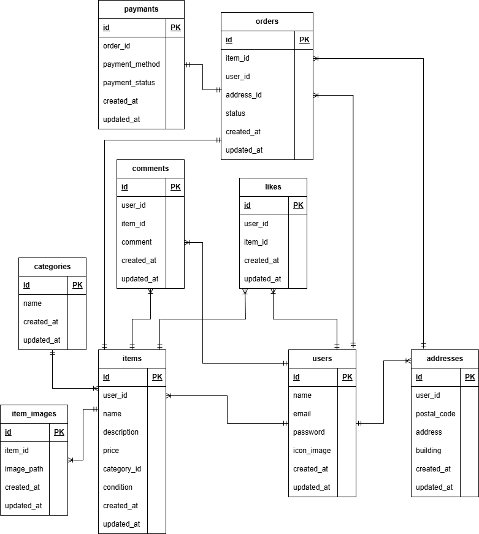

# フリマアプリ

Laravel を用いて作成したフリーマーケットアプリケーションです。  
ユーザー登録から、プロフィール編集、商品の出品、購入ができます。

---

## 使用技術

- PHP 8.x
- Laravel 8.x
- Laravel Fortify（ユーザー認証）
- MySQL （MariaDB 11.8 で動作確認）
- Docker / docker-compose
- Composer

---

## Docker ビルド

git clone https://github.com/nano8km30/free-market.git
cd  free-market

## Laravel 環境構築

docker-compose up -d --build
docker-compose exec php bash
composer install
cp .env.example .env (`.env` の `DB_HOST` は `mysql` を指定してください。)
php artisan key:generate
php artisan migrate:fresh --seed

## 開発環境

・商品一覧画面:http://localhost/
・登録画面:http://localhost/register
・ログイン画面:http://localhost/login

## ER 図

